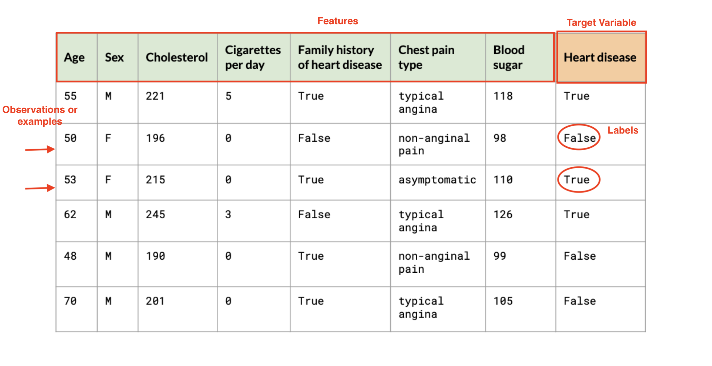
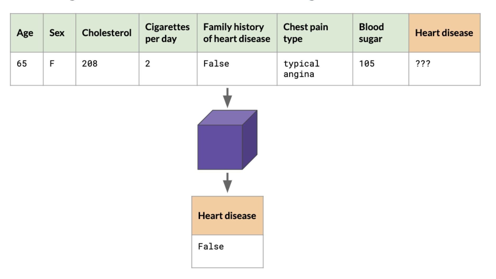
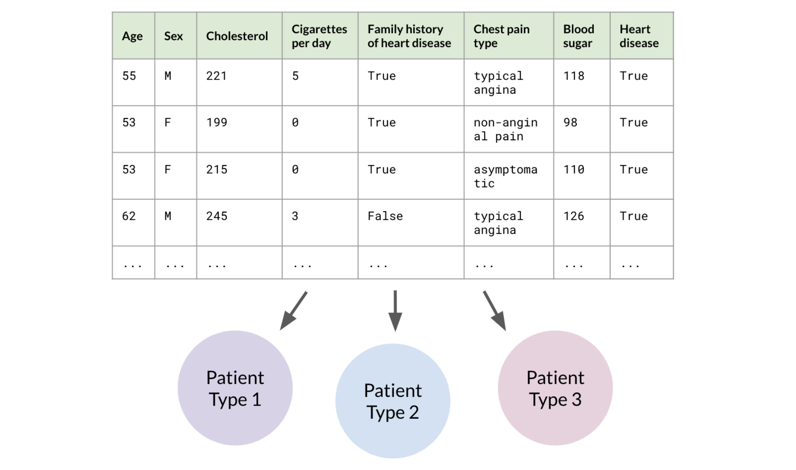
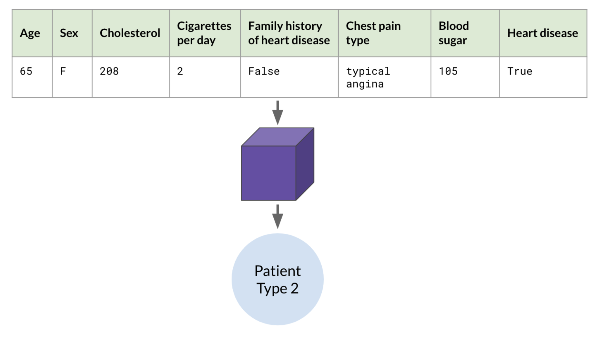
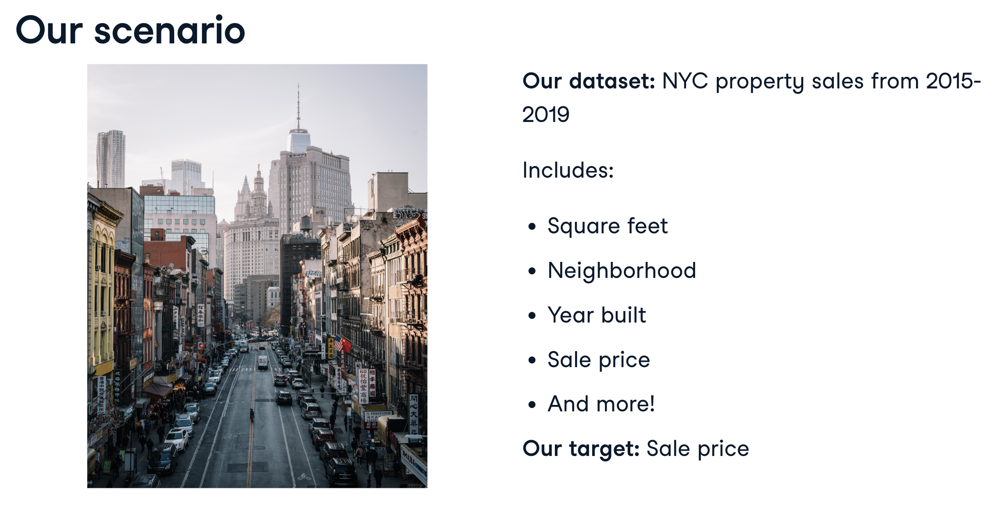

# Machine Learning

- Today, when refer to AI, it is most likely ML only
- AI is a huge set of tools to make computers behave intelligently
- ML is most important subset of AI

## What is ML?

A set of tools to making inferences and predictions from provided data

- Predict future events i.g.
  - Will it rain tomorrow? Yes (75% probability)
- Infer the causes of events and behaviors, it's more about drawing insights e.g.
  - Why does it rain?
- Infer patterns
  - Different types of weather conditions
    - Rainy, sunny etc.
- Inference helps to make predictions

## How does it work?

- It works with the help of statistics and computer science.
- It can learn without step by step instructions.
- It learns patterns from existing data and applies it to new data. i.g. analyzing the spammed emails, it will be able to detect whether an email is spam or not.
- It relies on high quality data

### What is use of Data Science?

Data science is about making discoveries and creating insights from data.

## ML Models

It's a statistical representation of a real-world process on data.

```
 [Cat Image] --> [Cat Detection Model] --> [Yes/No]

```

If we created a model based on traffic details with date wise,

```
[Future Date] --> [Traffic Prediction Model] --> [Traffic Conditions]
```

## Types of ML

1. Reinforcement Learning
2. Supervised Learning
3. Unsupervised Learning

- Training Data
  - existing data to learn from
- Training a Model
  - when a model is being built from training data

### Supervised Learning


After the model is trained on above data, we can make predicitons.


In supervised learning outcomes are known set of values i.e. for above it can either be true or false

### Unsupervised Learning

It doesn't have labels. It is only trained on features.
Usage:

- Anomaly detection
- Clustering or Grouping


In above, it categorized the data. One category could be high cholesterol and blood sugar in a certain age range.



In reality, data doesn't always come with labels.
It requires manual labour to label.
Label are unknown
No label means, model is unsupervised and finds its own patterns i.e. self driving cars.

## Machine Learning Workflow



The above scenario is a example of supervised learning because we already have target label i.e. sale price

### Step 1


### Step 2


Dataset is split into train and test dataset.

### Step 3


### Step 4


If model doesn't perform better i.e. the predictions are not accurate. We need to tune it.


### Overall Workflow


### Summary of steps

1. Extract features
   - Choosing features and manipulating the dataset
2. Split dataset
   - Train and test dataset
3. Train model
   - Input train dataset into a machine learning model
4. Evaluate
   - If desired performance isn’t reached: tune the model and repeat Step 3

## Supervised Learning

1. Classification
2. Regression

### Classification:

Assigning a category to an observation.

Examples:

- Will this custome stop the subscription? Yes/No
- Is this mole cancerous? Yes/No
- What kind of wine is this? Red/White/Rose
- What is this flower? Rose/Tulip/Lily

### Regression

Assigning a continuous variable

Examples:

- How much this stock be worth?
- What is this exoplanet's mass?
- How tall this child be as an adult?

### Classification Vs Regression

- Regression = continuous
  - Any value within a finite or infinite interval e.g 20F, 20.F
- Classification = category
  - One of few predefined values
    - Cold, Mild, Hot

## Unsupervised Learning

- Unsupervised learning = no target column
  - no guidance
- Looks at the whole dataset
- Tries to detect a pattern

1. Clustering
2. Anomaly Detection
3. Association

### Clustering

Groups the dataset based on their features

Clustering Models:

- K Means: needs to specify the number of clusters
- DBSCAN(density based spatial clustering of applications with noise): don't the number of clusters in advance rather it requires to specify what constitutes the cluster

### Anomaly Detection

Anomaly detection = detecting outliers

outliers = observations that defer from the rest

Usecase:

- Discover devices that fail faster or last longer
- Discover fraudster that manage trick the system
- Discover patients that resist a fatal disease

### Association

Finding relationship between observations.

Events happen together

Usecase:

- Market, Basket analysis - which objects bought together
- People buying beer likely to buy peanuts

## Evaluation

Overfitting:

- performs great on training data
- performs poorly on testing data
- model memorized training data and can't generalize learnings to new data
- using testing data set to check performance

Accuracy = correctly classified observation / all observations

e.g 48 \* 100 / 50 = 96%

Limits of Accuracy: fraud example


- False Negative : Telling a pregnant women that you are not pregnant
- False Positive: Telling a man he is pregnant
  

Above is a bad score, we must consider optimizing it.
